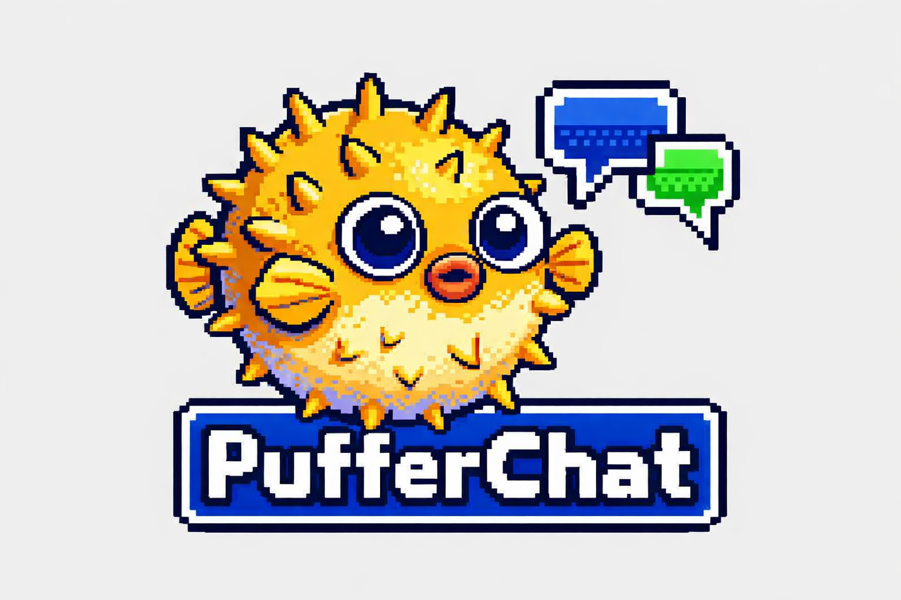

<p align="center">
  
</p>

<h1 align="center">PufferChat</h1>

<p align="center"><em>"You've Got Mail... Encrypted."</em></p>

<p align="center">
  
  
  
</p>

A custom **Matrix protocol** communication client with a retro **AOL Instant Messenger** aesthetic, built as a native desktop application. Full Element-level functionality with E2EE by default, zero telemetry, and a plugin system — wrapped in nostalgic 90s UI.

---

## ✨ Features

- 🔐 **End-to-End Encryption** — Megolm/Vodozemac, cross-signing, key backup, SSSS
- 💬 **Full Messaging** — Text, markdown, media, voice messages, reactions, threads
- 📞 **Voice & Video Calls** — 1:1 and group calls via WebRTC, screen sharing
- 🧩 **Plugin System** — TypeScript SDK, sandboxed iframes, 3 built-in plugins
- 🏠 **Spaces & Rooms** — Full Matrix Spaces hierarchy, room management, moderation
- 🎨 **AOL Retro UI** — Beveled borders, buddy list, IM windows, sound effects
- 🌙 **Dark Mode** — AOL Dark theme with CRT glow aesthetic
- 🛡️ **Privacy First** — Zero telemetry, Tor/SOCKS5 proxy, DoH, certificate pinning
- 👥 **Multi-Account** — Run multiple Matrix accounts simultaneously
- ♿ **Accessible** — ARIA labels, keyboard navigation, screen reader support, high contrast
- ⚡ **Performant** — Virtual scrolling, lazy media loading, LRU caches, <50MB binary

## 🏗️ Tech Stack

| Layer | Technology |
|-------|-----------|
| Shell | Tauri 2.x (Rust) |
| Matrix SDK | matrix-rust-sdk |
| Frontend | React 18 + TypeScript |
| Styling | CSS Modules + AOL Theme Engine |
| Local DB | SQLite (SQLCipher encrypted) |
| Secrets | OS Keychain (keyring-rs) |
| Build | Cargo + Vite + Tauri CLI |

## 📦 Installation

### Pre-built Binaries

Download the latest release for your platform:

- **Windows:** `PufferChat-1.0.0-setup.exe` (NSIS) or `.msi`
- **macOS:** `PufferChat-1.0.0.dmg`
- **Linux:** `PufferChat-1.0.0.AppImage` or `.deb`

### Build from Source

**Prerequisites:**
- Rust stable (1.75+)
- Node.js 20 LTS+
- Tauri CLI 2.x: `cargo install tauri-cli`
- Platform SDKs: Windows SDK (Win), Xcode CLI (Mac), webkit2gtk (Linux)

```bash
# Clone
git clone https://github.com/Void-Syndicate/PufferChat.git
cd PufferChat

# Install frontend dependencies
npm install

# Development (with HMR)
npm run tauri dev

# Production build
npm run tauri build
```

## 🔄 CI/CD

- `CI` runs on pull requests and pushes to `main`, checks version sync, builds the frontend, runs Rust tests, and smoke-builds the Tauri desktop app on Linux, Windows, and macOS.
- `Create Release` runs automatically on `main` when the app version files change, and can also be run manually from the Actions tab to create the matching GitHub tag/release for the current version.
- `Release` runs when a GitHub release is published and uploads Windows, macOS, and Linux bundles to that release.
- The normal release flow is: bump the version in `package.json`, `src-tauri/Cargo.toml`, and `src-tauri/tauri.conf.json`, merge to `main`, and the workflows create `vX.Y.Z` plus the cross-platform release assets automatically.
- Release tags must match the app version in `package.json`, `src-tauri/Cargo.toml`, and `src-tauri/tauri.conf.json` (for example, `v1.0.0`). Versions with a suffix such as `1.2.0-beta.1` are created as GitHub prereleases.
- Optional signing secrets:
  `WINDOWS_CERTIFICATE`, `WINDOWS_CERTIFICATE_PASSWORD`, `APPLE_CERTIFICATE`, `APPLE_CERTIFICATE_PASSWORD`, `KEYCHAIN_PASSWORD`, `APPLE_ID`, `APPLE_PASSWORD`, `APPLE_TEAM_ID`.
  If those secrets are not configured, the workflow still publishes unsigned artifacts.

## 🚀 Quick Start

1. Launch PufferChat
2. Enter your Matrix homeserver URL (e.g., `https://matrix.org`)
3. Sign in with username/password or SSO
4. Start chatting! Your Buddy List will populate automatically.

## 📖 Documentation

- [User Guide](docs/user-guide.md) — Complete usage guide
- [Keyboard Shortcuts](docs/keyboard-shortcuts.md) — All hotkeys
- [Plugin Development](docs/plugin-development.md) — Build custom plugins
- [Security Architecture](docs/VULNERABILITY-MANAGEMENT.md) — Security details

## 🧩 Plugins

PufferChat ships with 3 built-in plugins:

- **🎲 Dice Roller** — `/roll 2d20` for tabletop gaming
- **📊 Polls** — `/poll "Question" "Yes" "No"` for group decisions
- **💻 Code Paste** — `/paste` for syntax-highlighted code sharing

Create your own plugins with the [TypeScript Plugin SDK](docs/plugin-development.md).

## 🛡️ Privacy & Security

- **Zero telemetry** — No analytics, no tracking, no crash reporting
- **E2EE by default** — All DMs encrypted with audited Vodozemac
- **Tor support** — Route all traffic through SOCKS5 proxy
- **DNS-over-HTTPS** — Encrypted DNS resolution
- **Certificate pinning** — TOFU model for homeserver certs
- **Local-only data** — No cloud storage, all data stays on your machine
- **Memory zeroization** — Crypto keys cleared from RAM after use

## 🎨 Themes

- **AOL Classic** — The default retro experience
- **AOL Dark** — Dark mode with CRT phosphor glow
- **High Contrast** — Accessibility-focused high contrast mode

## 📜 License

MIT License — see [LICENSE](LICENSE) for details.

## 🙏 Credits

- [Matrix.org](https://matrix.org) — The protocol
- [matrix-rust-sdk](https://github.com/matrix-org/matrix-rust-sdk) — Rust SDK
- [Tauri](https://v2.tauri.app) — Native desktop framework
- AOL Instant Messenger — The aesthetic inspiration (RIP 1997-2017)

---

*Built with 🐡 by the Void Syndicate*
